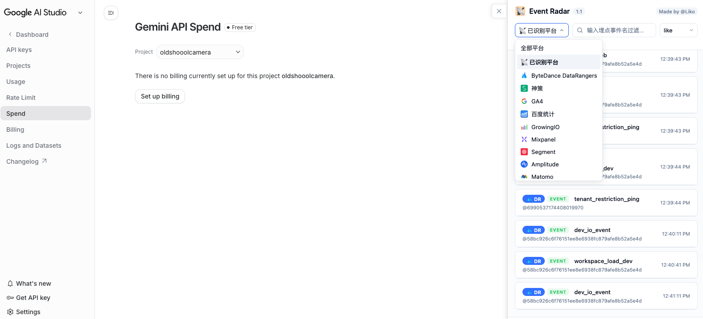
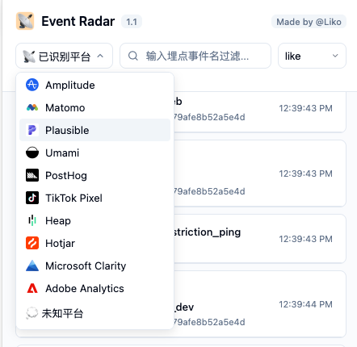
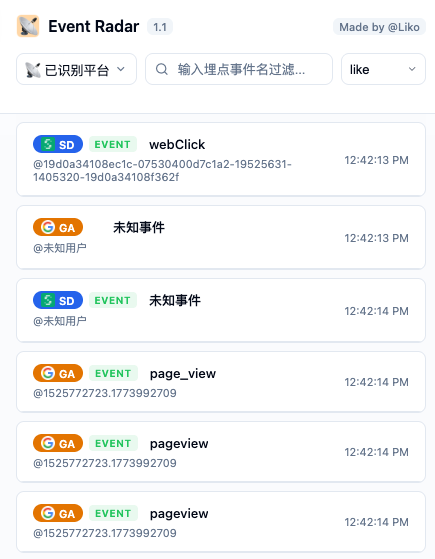
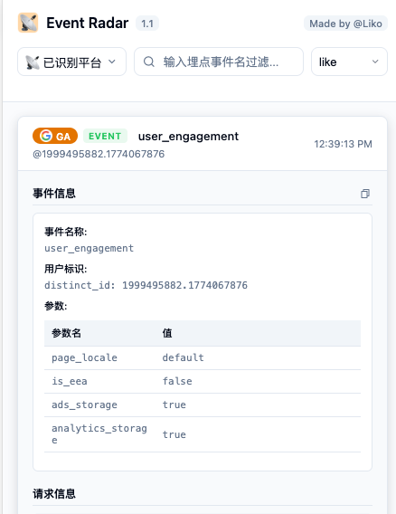

# Event Radar

一个用于捕获、识别、展示网页埋点请求的 Chrome 插件。

它适合前端、增长、数据、测试、产品在真实页面里快速回答这几个问题：

- 当前页面接入的埋点平台和上报埋点参数，例如 Google Analytics、Mixpanel、Amplitude、Segment、ByteDance Data 等主流埋点平台
- 这些请求更像哪家分析平台
- 事件名、用户标识、请求体里到底带了什么
- 当前页面有没有“未知平台 / 未适配请求”

## 截图预览

以下截图来自真实页面，仅作为插件展示效果示例。

### 页面内总览

插件直接挂在页面右侧，适合边操作页面边看埋点流。



### 平台筛选器

默认是“已识别平台”，也可以切换到单个平台或未知平台做排查。



### 多平台事件流

列表里会把不同平台的事件混合展示，适合快速看页面当前到底在发什么。



### 事件详情展开

点击卡片后可以直接看事件名、用户标识、参数表格和请求信息。



## 现在这版能做什么

- 实时捕获页面发出的埋点 / 分析 / 像素请求
- 支持浏览器 Side Panel 与页面右侧注入面板两种使用方式
- 默认仅展示“已识别平台”，降低噪音
- 支持切换为“全部平台”或“未知平台”排查漏识别
- 自动识别平台并给出置信度与匹配来源
- 展示事件名、用户标识、时间、请求详情、原始数据
- 支持搜索过滤，支持 `like / not like`
- 支持设置面板中的 URL Regex `过滤规则 / 白名单 / 常用预设`
- 支持 `Stop / Clear / CSV`
- CSV 导出优先使用平台适配器的归一化解析结果
- 支持拖拽调整面板宽度
- 对可疑 gzip / 二进制请求体保留 base64，供后续解析继续使用
- 对神策 gzip、知乎 gzip/protobuf 做异步二次解码
- 支持 iframe 页面上下文采集
- 结合 `script[src]`、cookie、主世界全局变量做平台识别加权
- 避开站点 CSP 的主世界探测，不再依赖会被拦截的内联脚本注入

## 支持的平台

当前内置 36 个已识别平台适配器：

- ByteDance Data
- 神策
- GA4
- 百度统计
- 阿里/淘宝
- 腾讯/QQ
- 网易
- 滴滴
- 美团
- 京东
- B站
- 携程
- Amazon
- 小红书
- 知乎
- 微博
- GrowingIO
- Mixpanel
- Segment
- Amplitude
- Matomo
- Plausible
- Umami
- PostHog
- TikTok Pixel
- Heap
- Hotjar
- Microsoft Clarity
- Microsoft UET
- Adobe Analytics
- Facebook / Meta Pixel
- LinkedIn Insight Tag
- Pinterest Tag
- Reddit Pixel
- X Pixel
- Snap Pixel

同时保留 `未知平台` 兜底视图，方便继续补规则。

补充说明：

- `Amazon` 当前指 Amazon 站内 telemetry 主链路，不是广告投放 Attribution 全量解析
- `B站`、`携程`、`知乎` 等少数平台当前以“稳定字段恢复”为主，不是私有协议完整逆向

## 识别方式

插件不是只看 URL，而是把几类线索组合起来做判断：

1. 请求本身
   - 请求地址
   - 查询参数
   - 请求体
   - 请求方法
2. 页面上下文
   - `script[src]`
   - cookie 特征
   - 页面主世界全局变量
3. 平台适配器加权
   - 请求命中是主判断
   - 页面上下文只做加分，不会单独把 `unknown` 硬拉成某个平台

当前请求体处理也不再只保留文本：

- 文本 body 会优先按 UTF-8 解码，再做回退
- 命中 gzip magic number 或明显二进制特征时，会额外保存 `requestBodyBase64`
- 这样像神策、知乎这类需要二次解码的请求，后续仍有解析机会

这次实现里，主世界探测改成了 CSP-safe 方案：

- 内容脚本只采集隔离世界可读的信息
- Service Worker 使用 `chrome.scripting.executeScript(..., { world: 'MAIN' })`
- 不再往页面里塞内联 `<script>`

## 安装

### 直接加载源码

1. 克隆仓库
2. 打开 `chrome://extensions/`
3. 开启右上角“开发者模式”
4. 点击“加载已解压的扩展程序”
5. 选择项目中的 [`tea_event_radar`](tea_event_radar) 文件夹

### 使用构建产物

构建后会生成：

- [`dist`](dist)
- [`tea_event_radar_dist.zip`](tea_event_radar_dist.zip)

你也可以直接解压 `dist` 后再加载。

## 本地开发

### 安装依赖

```bash
npm install
```

### 构建

```bash
npm run build
```

构建会做两件事：

- 复制扩展资源到 `dist/`
- 压缩 JS 并生成 `tea_event_radar_dist.zip`

## 使用方式

1. 打开任意网页
2. 点击扩展图标
3. 插件会把面板直接注入到当前页面右侧
4. 面板默认开始捕获
5. 默认筛选为“已识别平台”
6. 如果要排查漏识别，请切换到“全部平台”或“未知平台”
7. 点击事件卡片可查看详细数据
8. 通过搜索框和 `like / not like` 过滤结果
9. 如需降噪，可在右上角设置里添加过滤规则或白名单
10. 需要导出时点击 `CSV`

## 推荐使用姿势

### 快速看平台

- 保持默认的“已识别平台”
- 先确认页面接了哪些分析 SDK
- 再看对应事件名和用户标识

### 排查漏识别

- 切到“全部平台”
- 如果事件数增加但平台仍显示未知，说明请求已捕获但规则未适配
- 这时可以结合 URL、请求体、cookie、全局变量继续补平台规则

### 降低噪音

- 在设置面板里把静态资源、字体、SourceMap、WebSocket 等规则加到过滤列表
- 如果某个自定义采集域名被误过滤，用白名单规则覆盖
- 高频页面建议先把明显无关域名过滤掉，再开始复现操作

### 复现页面行为

- 先 `Clear`
- 再在页面里做一次真实操作
- 这样列表里保留的就是本轮操作产生的流量

## 项目结构

```text
tea_event_radar/
├── manifest.json
├── service-worker.js
├── content-script.js
├── panel.html
├── panel.js
├── panel.css
├── platform-catalog.js
├── platform-adapters.js
└── images/
```

根目录补充文件：

- [`build.js`](build.js)：构建脚本
- [`package.json`](package.json)：构建依赖与命令
- [`docs/screenshots`](docs/screenshots)：README 截图资源

## 技术要点

- Manifest V3
- `chrome.webRequest`
- `chrome.scripting`
- Side Panel + 页面内 iframe 面板注入
- 平台目录 + 平台适配器分层
- 页面上下文缓存
- `documentId / frameId` 关联请求与页面上下文
- 可疑二进制 body 的 base64 保留
- 神策 / 知乎异步二次解码
- CSP-safe 主世界探测

## 注意事项

- 当前事件列表是扩展当前会话内的捕获结果，不是服务端历史数据
- 默认“已识别平台”视图会隐藏未知流量，这不是没捕获，而是被过滤了
- 某些站点会持续发送心跳或 engagement 请求，事件数增长很快，排查时建议先 `Clear`
- 如果你在补新平台，优先先看“全部平台”视图
- 平台预过滤目前仍依赖已登记的 `host/path` 特征，自定义代理域名仍可能漏抓
- 当前代码里的版本号显示尚未完全统一：`manifest.json`、`package.json`、面板头部版本各自独立

## 仓库

- GitHub: <https://github.com/LikoHD/event_radar_chrome_extention>
