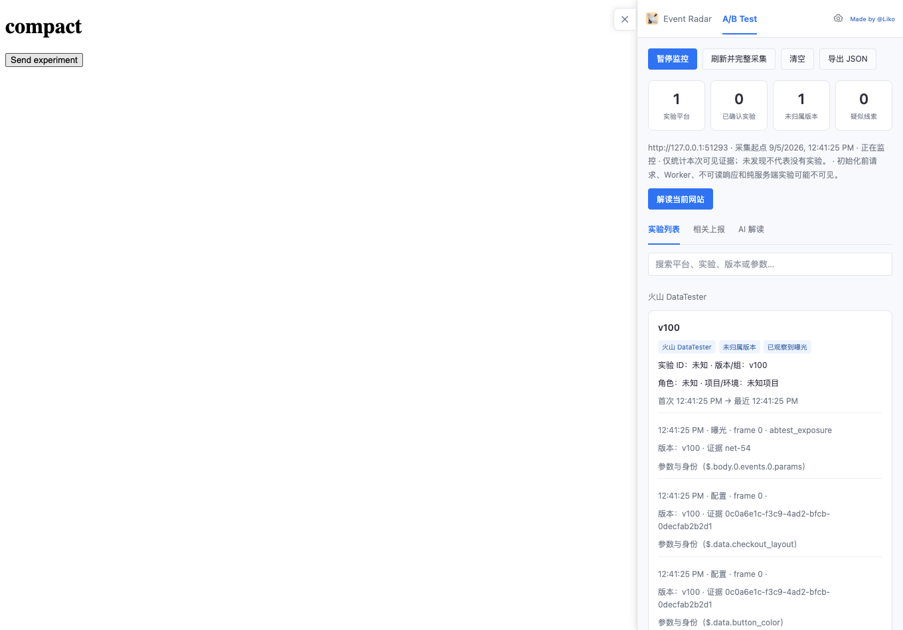
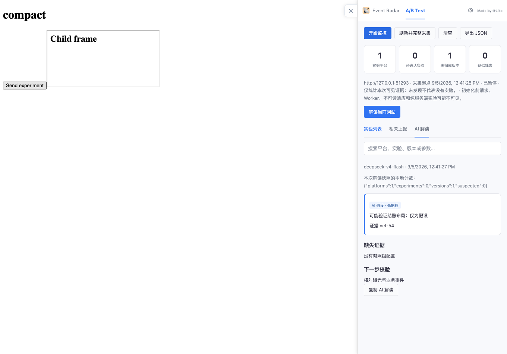
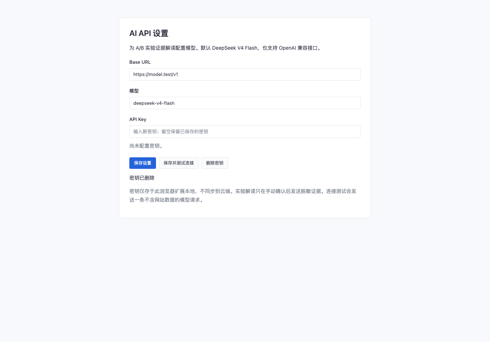

# TeaEventRadar 1.1.0 验证记录

> Status: Verified with local fixtures and mocked AI
> Last synced: 2026-09-05
> Freshness: FRESH

## 最终结果

- `npm test`：25 项通过，0 失败。
- `npm run build`：通过，输出 `dist` 和 `tea_event_radar_dist.zip`。
- 源码与压缩版均在独立 Chrome for Testing / Chromium 151 profile 中加载通过，无 pageerror。
- Manifest 路径引用、版本一致性和 ZIP CRC 校验通过；`git diff --check` 通过。
- ZIP 大小：202,198 字节。
- SHA-256：`56a108e34d0325b556e395d74eac1b658fcc24f0184d85212265ece29677cb54`。

## 浏览器实际验证

使用本地 HTTP 站点和真实扩展加载，未操作用户的日常 Chrome profile：

1. 通过页内插件面板打开 A/B Test，扫描并开始监控。
2. 页面原 fetch 读取 abtest_config 后收到原样 JSON，曝光通过原网络请求发送。
3. 配置中的两个参数共用一个 VID，结果为一个未归属版本、零个已确认实验。
4. 探针没有重发配置请求或增加曝光；XHR JSON 响应也保持原样。
5. 子 iframe 的配置响应捕获带非零 frameId，并归入所属 tab。
6. 暂停后不增加曝光记录。
7. 独立设置页可以保存/删除密钥，密钥输入保存后清空；隔离世界读存储被拒绝，网页上下文不能请求 AI 设置。
8. 使用后台 mock provider 跑完整的预览 → 确认 → 模型响应 → 解读展示；只产生一次模型调用，快照无 API Key 或原始用户身份。
9. 原埋点监控仍可采集、搜索并显示曝光事件。

## 自动化覆盖

火山、神策、Quick Tracking、Optimizely、GrowthBook、PostHog、VWO、Statsig、AB Tasty、LaunchDarkly 的已实现结构；默认值/普通开关/通用 group_id 不确认为实验；项目去重、重复曝光、身份变化、缺失身份不误报、证据截断和脱敏。

后台测试覆盖按 tab 隔离、清空、同源/跨源会话规则、内嵌面板归属、后台重启恢复、预览跨重启恢复、一次性 token 防重放、权限拒绝、AI 取消与 60 秒超时。模拟 API 测试覆盖成功、401/429/500、非法 JSON、缺失密钥、非法证据引用和中止信号。

## 已修复的验证问题

- 配置中缺失身份不再当作用户身份变化。
- 内部监控会话 ID 不会被业务身份脱敏规则替换，避免有效预览被误拒绝。
- 桥接控制消息显式回复，避免旧 content script 保持消息通道而导致监控命令等待。
- 监控操作串行处理，防止扫描、开始、暂停的界面状态相互覆盖。

## 尚未验证 / 边界

- 未使用真实 DeepSeek 密钥；测试模型响应由 mock provider 生成。
- 没有宣称在上述 SaaS 所有生产客户网站验证过；大部分平台是公开字段构造的协议测试。
- 百度统计实验、腾讯云 AB 平台仍是候选适配，未开启无依据的命名识别。
- 原生浏览器 side panel 界面未单独进行桌面 UI 验证，使用与已验证页内面板相同的页面，tab 归属分支有单元测试。
- Worker、HttpOnly、纯服务端或加密实验、早于握手的初始化响应可能不可见。

详见[实现与适配范围](../abtest-explorer-0905.md)。

## 界面截图

